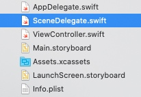
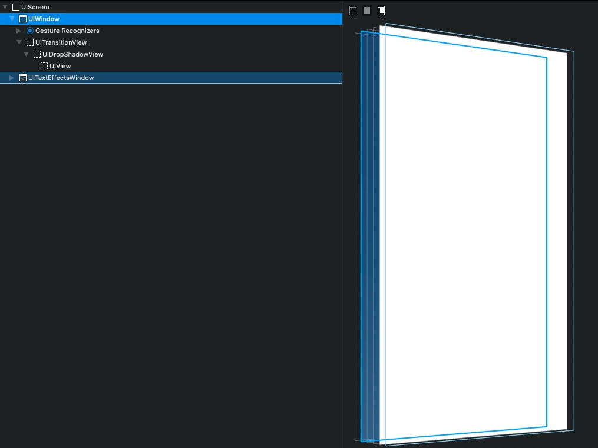
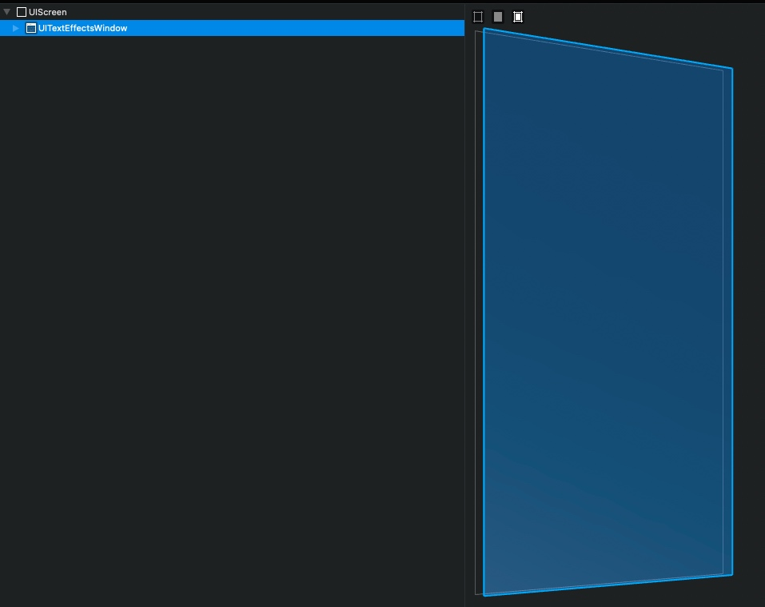
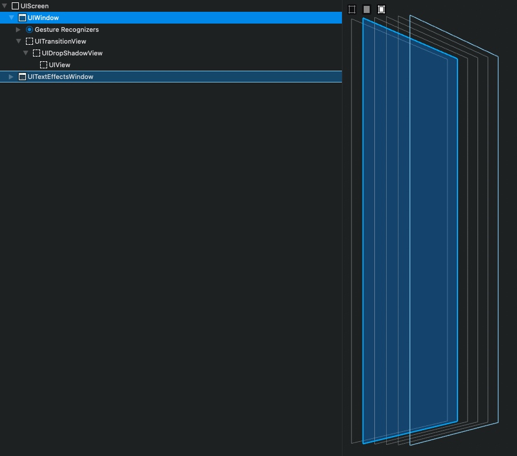
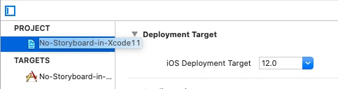
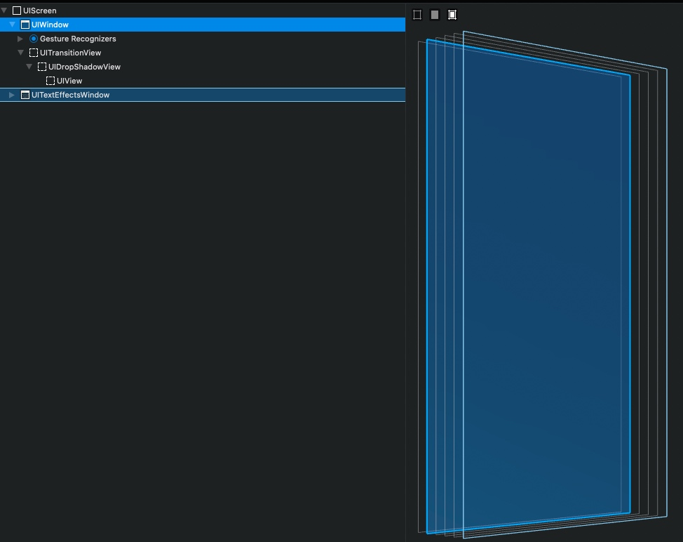
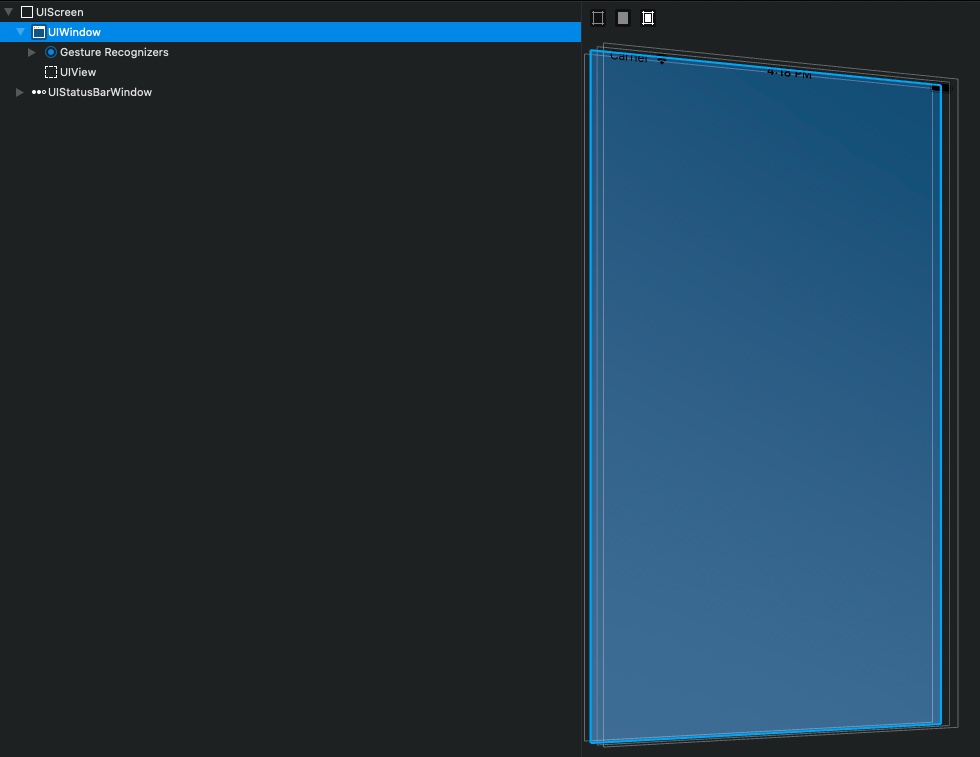

# 在 Xcode 11 创建的项目中，如何停用 Storyboard 

> 按照以前的做法，删掉 `Main.storyboard`，并在 info.plist 里面把 `Main` 这个值置为空就可以了。然而在 Xcode 11 创建的项目中，这样做会 crash，下面就介绍一下如何在 Xcode 11 中停用 Storyboard。


我们先用 `Xcode 11` 创建一个新的项目。最直观的不同，是多了一个 `SceneDelegate.swift` 文件：



直接 run，跑起来是白屏，UI 层级与之前不同，且多了一个 `UITextEffectsWindow`：



## 若只需要适配 iOS 13 

此时建议保留使用 `SceneDelegate.swift`，毕竟是推荐使用的新 API。

1. 把 `Main.storyboard` 删掉；
2. Target - General - Main Interface，把 `Main` 删掉；
3. 全局搜索 `Main`，把 `info.plist` 里 `Storyboard Name`-`Main` 这一键值对删掉，不能只把值置空，否则系统还是要去检索 Storyboard，并且会因为找不到而 crash。

再 run，就能跑起来了，这个时候没有 window，需要手动创建一个：



iOS 13 之前，都是在 `AppDelegate` 中创建 window，然而在 iOS 13 中，需要在 `SceneDelegate` 中创建：

```objc
func scene(_ scene: UIScene, willConnectTo session: UISceneSession, options connectionOptions: UIScene.ConnectionOptions) {
        // Use this method to optionally configure and attach the UIWindow `window` to the provided UIWindowScene `scene`.
        // If using a storyboard, the `window` property will automatically be initialized and attached to the scene.
        // This delegate does not imply the connecting scene or session are new (see `application:configurationForConnectingSceneSession` instead).
        guard let windowScene = (scene as? UIWindowScene) else { return }
        window = UIWindow(windowScene: windowScene)
        window?.frame = windowScene.coordinateSpace.bounds
        window?.rootViewController = ViewController()
        window?.makeKeyAndVisible()
    }
```

再 run，代码创建的 window 就出现了，层级依然和之前一样，只是都没有底色：



## 若需要适配 iOS 13 以下的系统

这种情况下，使用 `SceneDelegate` 可能就比较麻烦了，许多代码都得写两套，建议回退到 Xcode 10 的写法。下面给个示例：




1. 把 `Deployment Target` 改成 12.0；
2. 删除 `SceneDelegate.swift`；
3. 删除 `AppDelegate` 中 `UISceneSession Lifecycle` 相关的代码； 
4. 删除 `info.plist` 里面的 `Application Scene Manifest` 这一项；
5. 在 `AppDelegate` 中添加 window 属性，并在 `didFinishLaunchingWithOptions` 方法中创建 window：

```objc
import UIKit

@UIApplicationMain
class AppDelegate: UIResponder, UIApplicationDelegate {

    var window: UIWindow?
    
    func application(_ application: UIApplication, didFinishLaunchingWithOptions launchOptions: [UIApplication.LaunchOptionsKey: Any]?) -> Bool {
        // Override point for customization after application launch.
        window = UIWindow(frame: UIScreen.main.bounds)
        window?.rootViewController = ViewController()
        window?.makeKeyAndVisible()
        return true
    }
}
```

iOS 13 跑起来后，层级和之前一样：



iOS 12 跑起来后，层级里没有 `UITextEffectsWindow`，而是有一个 `UIStatusBarWindow`：



那么，iOS 13 中为什么没有 `UIStatusBarWindow` 了呢？新添加的 `UITextEffectsWindow` 作用又是什么呢？敬请期待下一篇内容。

